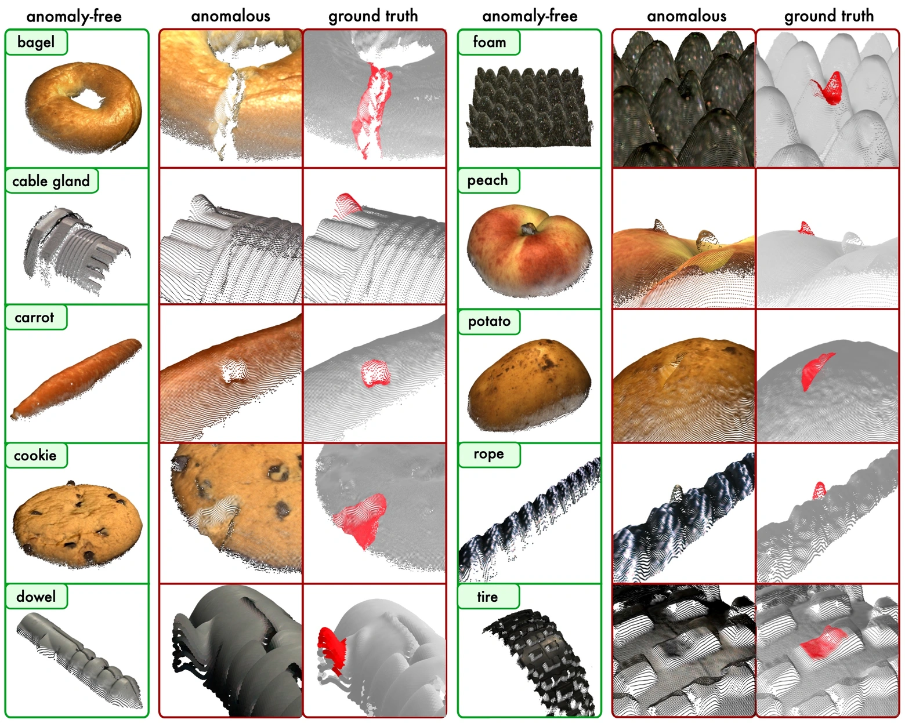

# Awesome-3D-AnomalyDetection 

Anomaly detection on 3D point cloud data has been a rising topic recently and has wide-range applications in real-world applications, especially in industrial scenarios. This repository summarizes the state-of-the-art methods and the related papers. The literature are listed in alphabet order for each section.

## Dataset 

  

 **[MVTec 3D-AD]** | The MVTec 3D-AD Dataset for Unsupervised 3D Anomaly Detection and Localization | **VISAPP' 22** | [[pdf]](https://arxiv.org/pdf/2112.09045.pdf) [[website]](https://www.mvtec.com/company/research/datasets/mvtec-3d-ad)

## Unsupervised 3D Anomaly Detection (and Localization) on MVTec 3D-AD Dataset

### Performance Comparison on MvTEC 3D 
| Time | Method | Image-level AUROC (%) | Pixel-level AUPRO (%) |
| --- | ------- | ----------- | ------- |
| 2021 | [3D-Only-Voxel-VM](#1)| 69.9   | 49.2  |
| 2021 | [3D+RGB-Voxel-VM](#1)| 51.7   | 63.9  |
| 2022 | [BTF](#2) | 86.5   | **96.4**  |
| 2022 | [3D-ST](#3)| -   | 83.3 |
| 2022 | [RGB+PaDim](#4)| 76.4   |  93.0 |
| 2022 | [RGB+PatchCore](#4)| 81.1  | 91.0  |
| 2022 | [AST](#5) | 93.7   |   -   |
| 2022 | [PEFM](#6)|    -   | 94.2 |
| 2023 | [CDO](#7)| -   | 93.8 |
| 2023 | [M3DM](#7)| 94.5   | **96.4**  |
| 2023 | [CPMF](#8)| **95.2**   | 92.9  |

- **[3D-Only-Voxel-VM,3D+RGB-Voxel-VM]** The MVTec 3D-AD Dataset for Unsupervised 3D Anomaly Detection and Localization | **VISAPP' 22** | [[pdf]](https://arxiv.org/pdf/2112.09045.pdf) [[website]](https://www.mvtec.com/company/research/datasets/mvtec-3d-ad)
- **[BTF]** Back to the Feature: Classical 3D Features are (Almost) All You Need for 3D Anomaly Detection   | **arXiv' 22** | [[pdf]](https://arxiv.org/pdf/2203.05550.pdf) [[code]](https://github.com/eliahuhorwitz/3D-ADS)
- **[3D-ST]** Anomaly Detection in 3D Point Clouds Using Deep Geometric Descriptors   | **WACV' 23** | [[pdf]](https://openaccess.thecvf.com/content/WACV2023/papers/Bergmann_Anomaly_Detection_in_3D_Point_Clouds_Using_Deep_Geometric_Descriptors_WACV_2023_paper.pdf) 
- **[RGB+PaDim,RGB+PatchCore]** Benchmarking Unsupervised Anomaly Detection and Localization  | **arXiv' 22** | [[pdf]](https://arxiv.org/pdf/2205.14852.pdf) 
- **[AST]** Asymmetric Student-Teacher Networks for Industrial Anomaly Detection  | **WACV' 23** | [[pdf]](https://arxiv.org/pdf/2210.07829.pdf) [[code]](https://github.com/marco-rudolph/ast)
- **[PEFM]** Position Encoding Enhanced Feature Mapping for Image Anomaly Detection  | **IEEE 18th International Conference on Automation Science and Engineering (CASE)** | [[pdf]](https://ieeexplore.ieee.org/stamp/stamp.jsp?tp=&arnumber=9926547) 
- **[CDO]** Collaborative Discrepancy Optimization for Reliable Image Anomaly Localization   | **IEEE Transactions on Industrial Informatics** | [[pdf]](https://arxiv.org/pdf/2302.08769.pdf) [[code]](https://github.com/caoyunkang/CDO) 
- **[M3DM]** Multimodal Industrial Anomaly Detection via Hybrid Fusion  | **CVPR' 23** | [[pdf]](https://arxiv.org/pdf/2303.00601.pdf)  [[code]](https://github.com/nomewang/M3DM)
- **[CPMF]** Complementary Pseudo Multimodal Feature for Point Cloud Anomaly Detection   | **Pattern Recognition' 23 (under review)** | [[pdf]](https://arxiv.org/pdf/2303.13194.pdf) [[code]](https://github.com/caoyunkang/CPMF)

## 3D Anomaly Detection on Other Datasets

- Anomaly detection in 3D space for autonomous driving | **KIT Dissertation Paper** | [[PDF]](https://publikationen.bibliothek.kit.edu/1000148848/149058936)
- Toward Unsupervised 3d Point Cloud Anomaly Detection Using Variational Autoencoder | **ICIP' 21**| [[PDF]](https://ieeexplore.ieee.org/stamp/stamp.jsp?tp=&arnumber=9506795)
  

