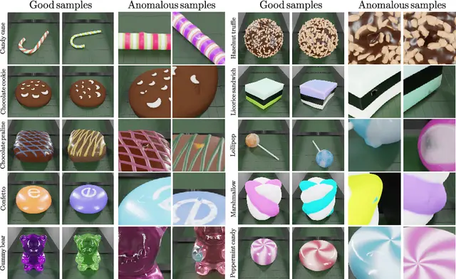

# Awesome-3D-ADL 

Anomaly detection and localization on 3D point cloud data has been a rising topic recently and has wide-range applications in real-world applications, especially in industrial scenarios. This repository summarizes the state-of-the-art methods and the related papers. The literature are listed in alphabet order for each section.

## Dataset 

  

 **[MVTec 3D-AD]** | The MVTec 3D-AD Dataset for Unsupervised 3D Anomaly Detection and Localization | **VISAPP' 22** | [[pdf]](https://arxiv.org/pdf/2112.09045.pdf) [[website]](https://www.mvtec.com/company/research/datasets/mvtec-3d-ad)

  

 **[Eyecandies]** | The Eyecandies Dataset for Unsupervised Multimodal Anomaly Detection and Localization | **ACCV' 22** | [[pdf]](https://arxiv.org/pdf/2210.04570.pdf) [[website]](https://eyecan-ai.github.io/eyecandies)

  

 
 **[Real3D-AD]** | Real3D-AD: A Dataset of Point Cloud Anomaly Detection | **NeurIPS' 23** | [[pdf]](https://arxiv.org/pdf/2309.13226.pdf) [[website]](https://github.com/M-3LAB/Real3D-AD)

## Unsupervised 3D Anomaly Detection (and Localization)

### Performance Comparison on MvTEC 3D 
| Time | Method | Image-level AUROC (%) | Pixel-level AUPRO (%) |
| --- | ------- | ----------- | ------- |
| 2021 | [3D-Only-Voxel-VM](#1)| 69.9   | 49.2  |
| 2021 | [3D+RGB-Voxel-VM](#1)| 51.7   | 63.9  |
| 2022 | [BTF](#2) | 86.5   | 96.4  |
| 2022 | [3D-ST](#3)| -   | 83.3 |
| 2022 | [RGB+PaDim](#4)| 76.4   |  93.0 |
| 2022 | [RGB+PatchCore](#4)| 81.1  | 91.0  |
| 2022 | [AST](#5) | 93.7   |   -   |
| 2022 | [PEFM](#6)|    -   | 94.2 |
| 2023 | [CDO](#7)| -   | 93.8 |
| 2023 | [M3DM](#8)| 94.5   | 96.4  |
| 2023 | [CPMF](#9)| **95.2**   | 92.9  |
| 2023 | [Shape-Guided](#10)| 94.7   | **97.6**  |

- **[3D-Only-Voxel-VM,3D+RGB-Voxel-VM]** The MVTec 3D-AD Dataset for Unsupervised 3D Anomaly Detection and Localization | **VISAPP' 22** | [[pdf]](https://arxiv.org/pdf/2112.09045.pdf) [[website]](https://www.mvtec.com/company/research/datasets/mvtec-3d-ad)
- **[BTF]** Back to the Feature: Classical 3D Features are (Almost) All You Need for 3D Anomaly Detection   | **arXiv' 22** | [[pdf]](https://arxiv.org/pdf/2203.05550.pdf) [[code]](https://github.com/eliahuhorwitz/3D-ADS)
- **[3D-ST]** Anomaly Detection in 3D Point Clouds Using Deep Geometric Descriptors   | **WACV' 23** | [[pdf]](https://openaccess.thecvf.com/content/WACV2023/papers/Bergmann_Anomaly_Detection_in_3D_Point_Clouds_Using_Deep_Geometric_Descriptors_WACV_2023_paper.pdf) 
- **[RGB+PaDim,RGB+PatchCore]** Benchmarking Unsupervised Anomaly Detection and Localization  | **arXiv' 22** | [[pdf]](https://arxiv.org/pdf/2205.14852.pdf) 
- **[AST]** Asymmetric Student-Teacher Networks for Industrial Anomaly Detection  | **WACV' 23** | [[pdf]](https://arxiv.org/pdf/2210.07829.pdf) [[code]](https://github.com/marco-rudolph/ast)
- **[PEFM]** Position Encoding Enhanced Feature Mapping for Image Anomaly Detection  | **IEEE 18th International Conference on Automation Science and Engineering (CASE)** | [[pdf]](https://ieeexplore.ieee.org/stamp/stamp.jsp?tp=&arnumber=9926547) 
- **[CDO]** Collaborative Discrepancy Optimization for Reliable Image Anomaly Localization   | **IEEE Transactions on Industrial Informatics** | [[pdf]](https://arxiv.org/pdf/2302.08769.pdf) [[code]](https://github.com/caoyunkang/CDO) 
- **[M3DM]** Multimodal Industrial Anomaly Detection via Hybrid Fusion  | **CVPR' 23** | [[pdf]](https://arxiv.org/pdf/2303.00601.pdf)  [[code]](https://github.com/nomewang/M3DM)
- **[CPMF]** Complementary Pseudo Multimodal Feature for Point Cloud Anomaly Detection   | **Pattern Recognition' 23 (under review)** | [[pdf]](https://arxiv.org/pdf/2303.13194.pdf) [[code]](https://github.com/caoyunkang/CPMF)
- **[Shape-Guided]** Complementary Pseudo Multimodal Feature for Point Cloud Anomaly Detection   | **ICML' 23** | [[pdf]](https://proceedings.mlr.press/v202/chu23b/chu23b.pdf) [[code]](https://github.com/jayliu0313/Shape-Guided)
- **[IMRNet]** Towards Scalable 3D Anomaly Detection and Localization: A Benchmark via 3D
Anomaly Synthesis and A Self-Supervised Learning Network   | **CVPR' 24** | [[pdf]](https://arxiv.org/pdf/2311.14897) [[code]](https://github.com/Chopper-233/Anomaly-ShapeNet)
- **[Looking3D]** Looking 3D: Anomaly Detection with 2D-3D Alignment   | **CVPR' 24** | [[pdf]](https://openaccess.thecvf.com/content/CVPR2024/papers/Bhunia_Looking_3D_Anomaly_Detection_with_2D-3D_Alignment_CVPR_2024_paper.pdf) [[code]](https://github.com/VICO-UoE/Looking3D)
- **[R3D-AD]** R3D-AD: Reconstruction via Diffusion for 3D
Anomaly Detection   | **ECCV' 24** | [[pdf]](https://arxiv.org/pdf/2407.10862)
- **[DM-Multi-view-AD]** Learning Diffusion Models for Multi-View
Anomaly Detection   | **ECCV' 24** | [[pdf]](https://www.ecva.net/papers/eccv_2024/papers_ECCV/papers/04907.pdf) [[code]](https://github.com/jayliu0313/Diffusion_Multi-View_AD) 

## Zero-shot 3D Anomaly Detection (and Localization)
- **[PointAD]** PointAD: Comprehending 3D Anomalies from Points and Pixels for Zero-shot 3D Anomaly Detection   | **NeurIPS' 24** | [[pdf]](https://arxiv.org/pdf/2410.00320) [[code]](https://github.com/zqhang/PointAD)
- **[3DzAL]** Towards Zero-shot 3D Anomaly Localization   | **WACV' 25** | [[pdf]](https://arxiv.org/pdf/2412.04304) [[project page]](https://wyzjack.github.io/3DzAL/)

## Unified 3D Anomaly Detection (and Localization)
- **[HGAD]** Hierarchical Gaussian Mixture Normalizing Flow
Modeling for Unified Anomaly Detection   | **ECCV' 24** | [[pdf]](https://arxiv.org/pdf/2403.13349) [[code]](https://github.com/xcyao00/HGAD)

## 3D Anomaly Detection on Other Datasets

- Anomaly detection in 3D space for autonomous driving | **KIT Dissertation Paper** | [[PDF]](https://publikationen.bibliothek.kit.edu/1000148848/149058936)
- Toward Unsupervised 3d Point Cloud Anomaly Detection Using Variational Autoencoder | **ICIP' 21**| [[PDF]](https://ieeexplore.ieee.org/stamp/stamp.jsp?tp=&arnumber=9506795)
  

